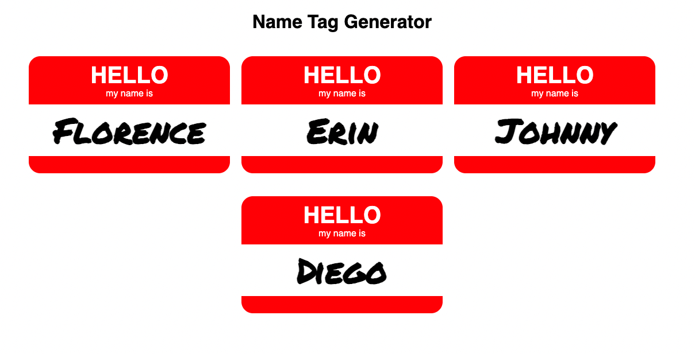

# Name Tag Generator ReactJS

This is a name tag generator made with ReactJS. It can be updated to display new name tags. 

### Screenshot

### Links

- Live Site URL: [CodeSandbox](https://codesandbox.io/s/l5-write-a-functional-component-name-tag-part-1-5-5-obn3u)

### Built with

- Semantic HTML5 markup
- CSS 
- JavaScript 
- ES6
- JSX
- [React](https://reactjs.org/) - JS library
